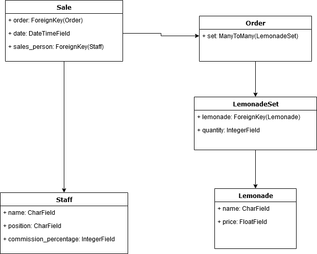

# Django challenge

In order to run the django program, first have django installed in python. Then in the console run the server.
This can be done by using these commands:

pip install django

cd lemonade

python manage.py runserver

then simply open the website on a browser by using the local address: http://127.0.0.1:8000